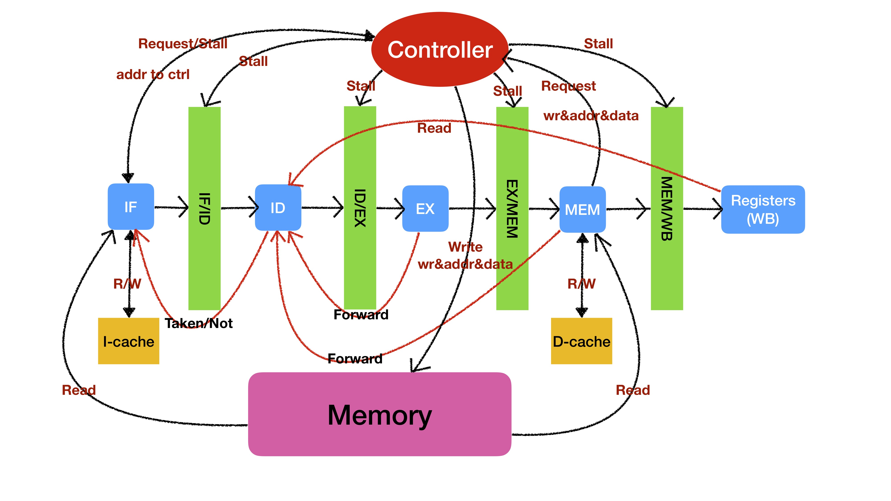
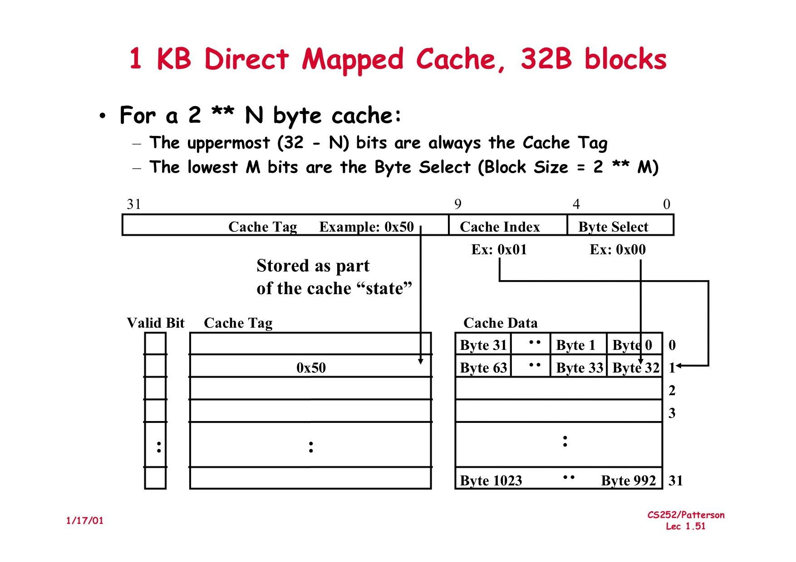

# RISC-V CPU report

by 刘成锴

## 一、实现过程

在实现过程中，我主要参考了《自己动手写CPU》，在书的基础上首先实现了ALU指令（logic & shift），之后实现了jump、branch指令。

由于访问内存和处理Structural Hazard有难点，所以我先通过自己构造数据，设计顶层模块，实现了4字节取指令，确保自己的ALU指令和跳转指令、分支指令是正确的。

之后我重新设计了if阶段和mem阶段，实现了Load/Store指令，处理了Structural Hazard，初步完成了项目。

## 二、设计思路

总体设计如下图。

### Controller

1. 控制流水线，接受来自IF和MEM的stall request，发送stall信号至IF, IF/ID, ID/EX, EX/MEM, MEM/WB。

2. 接受来自IF的mem_a，MEM的mem_wr, mem_a和mem_dout，并且选择向内存发送的写使能信号mem_wr、访问地址addr(mem_a)、写入数据data(mem_dout)。

### 取指令 IF

由于访问内存一次只能1个byte，所以我的取指令设计是6周期取指令。

1. 发地址
2. 发地址
3. 发地址，收数据
4. 发地址，收数据
5. 收数据
6. 收数据，得到完整指令

在取指令时，向

Structural hazard的情况后面说明。

### i-cache

在icache模块中，实现了Instruction cache，是一个**1KB直接映射的cache**。实现方式类似于下图。

当IF阶段6周期取到指令时，第六周期向icache模块发送取到的指令和相应地址，inst和addr将在下一周期写入icache。

当添加了icache后，IF的第一周期发送地址，如果cache hit后，第二周期收到指令，取指完成，不用再发送地址，pc寄存器加4，下周期可以取下一条指令。

### 动态分支预测 BHT

如果不分支预测，branch指令将在ID阶段对比rs和rt的值判断是否跳转。

动态分支预测的branch history table通过128个2位饱和计数器实现。当前pc值模128得到计数器编号。

在下一周期，由ID阶段发送信息判断预测是否正确，并调整计数器值。若预测错误，具体情况在control hazard说明。

### Load/Store

MEM阶段load需要3/4/6周期，store需要2/3/5周期。

### d-cache

在dcache模块中，实现了data cache，是一个**1KB直接映射的cache，采取write through策略**。

当LW或SW指令完成后，会将data和相应addr写入dcache。

添加了dcache后，实现了2周期Load。

### Hazard处理

**处理特点**：只有在处理Structural Hazard时需要暂停，向controller发送stall request，Data Hazard和Control Hazard均不需要暂停，即无需向controller发送request。

#### 1. Structural Hazard

当MEM阶段是Load/Store类指令是，由于IF和Load/Store都需要访问内存，产生Structural Hazard。

我采取的策略是向controller发送stall请求，停止IF、ID、EX、WB阶段，暂停流水。当Load/Store结束后，其他阶段继续执行，恢复流水。即优先执行MEM。

#### 2. Data Hazard

采取forward的方式，将EX、MEM阶段的结果forward至ID阶段，解决Data Hazard。

#### 3. Control Hazard

当分支预测失败时，流水线并不需要暂停。因为取指令至少需要2个周期。只需要将pc更改，重新开始在新的pc处取指令。

### 完成Bonus

* 上板 100MHz 测试通过
* **BHT**实现动态分支预测 by **2-bit saturating counters**
* 实现了**i-cache** by **direct mapped cache**
* 实现了**d-cache** by **direct mapped cache**

## 三、难点和问题

### 1. 与内存有关的处理

由于内存读数据需要2周期，写只需要1周期，因此实现取指令比较困难。

内存不能同时进行读写。处理structural hazard也比较困难。

通过跟室友讨论，并且参考了一些同学的实现方式，最终采取了比较稳妥的方式来取指令与对内存进行读写，确保不容易出错。但由于取指令所用的周期数较多，一定程度上牺牲了性能。

### 2. CPU性能的提升

为了提升性能，我完成了动态分支预测、i-cache和d-cache，其中i-cache对性能提升是最大的。提高d-cache大小对性能提升并不是非常显著，而提高i-cache大小对性能提升比较理想。

### 3. 限制CPU性能的主要因素

限制我的CPU速度的主要因素是取指令。为了稳妥，在完成一条取指令前，我并不会发送下一条指令的地址，这导致取指令的周期数较多。如果cache miss将要6周期，cache hit将要2周期。如果优化，是可以做到cache miss 4周期取指令，cache hit 1周期取指令的。但是由于调试困难，最终没有完全实现。

### 4. cache的实现

我开了2个git branch分别尝试将i-cache写入IF模块，d-cache写入MEM模块，以减少周期数，最终能只通过部分测试，因此没有完全成功。并且，将i-cache写入IF模块，d-cache写入MEM模块的可行性尚未验证。

主要困难来自于自己对时序逻辑理解不深，导致自己fix bug困难。

##### 5. 上板的困难

由于上板synthesis, implement & generate bitstream需要很长时间，导致自己每次更改和提升代码，验证正确性和性能提升都需要很长时间，一定程度打击了自己提升板上性能的积极性。

## 四、收获

1. 学习了Verilog编程，熟悉了Verilog语言，提升了自己的编程能力
2. 加深了自己对五级流水的认识，并且运用到了体系结构课上学到的知识，比如slides上的direct mapped cache和2-bit saturating counters
3. 由于本次作业是在Linux系统上实现的，我通过此次机会装了Linux双系统，并对Linux系统更加熟悉了，并且提升了自己的配环境能力